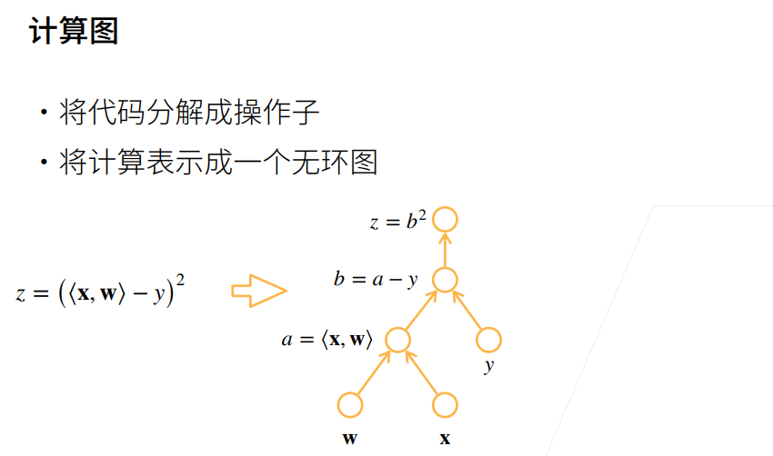
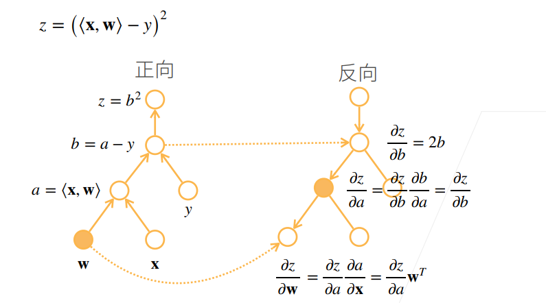

自动求导，主要依赖于链式法则

链式法则：$$\frac{\partial y}{\partial x}=\frac{\partial y}{\partial u_{n}}\frac{\partial u_{n}}{\partial u_{n-1}}\dots\frac{\partial u_{2}}{\partial u_{1}}\frac{\partial u_{1}}{\partial x}$$

正向积累：$$\begin{aligned}\frac{\partial y}{\partial x}=\frac{\partial y}{\partial u_n}\left(\frac{\partial u_n}{\partial u_{n-1}}\left(\dots\left(\frac{\partial u_2}{\partial u_1}\frac{\partial u_1}{\partial x}\right)\right)\right)\end{aligned}$$

反向积累，又叫反向传递：$$\left.{\frac{\partial y}{\partial x}}=\left(\left({\frac{\partial y}{\partial u_{n}}}{\frac{\partial u_{n}}{\partial u_{n-1}}}\right)\dots\right){\frac{\partial u_{2}}{\partial u_{1}}}\right){\frac{\partial u_{1}}{\partial x}}$$

因此我们可以从最终结果开始，一步步反向计算，得到导数。

自动求导有别于符号求导和数值求导。

- 自动求导：计算一个函数在指定值上的导数。
- 符号求导：保留变量符号的求导。
- 数值求导：直接$$lim$$求近似。

在pytorch中，反向传播计算要求开始计算的$$y$$是一个标量（标量：$$x$$，向量：$$[x_1,x_2,x_3,...]$$，常量：$$a$$），当$$x$$是向量$$X$$时，$$y=f(x)$$有可能是一个向量，向量对向量连续求导非常麻烦，因此求梯度时我们要求从标量开始反向传播求梯度。

#### Q1：如何反向传播求梯度。

原理：构造计算图





这么做的好处是我计算完了上一层的结果可以直接传给下一层，不需要保存当前的求导结果。

#### Q2：反向传播的pytorch底层原理

pytorch主要追踪(track)在x上的所有操作来构造计算树，进而在用户调用backward函数时根据构造的计算树来回溯求导过程。操作符运算会构造新的Tensor对象，新的Tensor对象的计算树会重新从x开始构造。

在pytorch的操作中，都分别有`forward`和`backward`函数，`forward`就是正常计算，在x启用`grad`属性时，操作函数在进行`forward`的同时还会为`backward`的计算做些预处理，比如缓存中间变量，设定flag等，方便`backward`的计算。`forward`和`backward`并不是完全割裂的。

虽然前面说了由于向量对向量的求导计算非常麻烦，必须从标量开始反向传递，但在反向传播的过程中，大部分情况下都会不可避免地遇到向量对向量的求导，举个非常简单的例子，如：

```python
x = torch.ones(1, 4, requires_grad=True) 
y = 2 * x + 1
z = torch.norm(z, 2, dim=1)
```

这里$$z->y->x$$的过程中，$$\frac{\partial y}{\partial x}$$就是向量对向量。当遇到这种情况时，pytorch会特殊处理，包括但不限于跳过计算等（当然在这里因为能推出表达式，所以不需要），遇到实在是解决不了的情况，可能会直接用数值求导解出来。对于无法求导的情况，可能会抛出警告并给`grad`赋值为`None`，取决于代码作者如何写`backward`。

#### Q3：对向量变量调用`backward`

在pytorch里，不能直接求向量的梯度，必须得把向量转化为标量，调用方法：

`u.backward(v)`

上式会先计算$$v*u$$，再对计算的结果进行反向传播。一般来讲，如果$$u$$是向量，我们要求$$u$$的梯度，可以选择直接求和(sum)或者让`v=[1,1,1,...]`。我们以三维向量举例：

$$X=(x_1,x_2,x_3)^T, Y=f(X)=(y_1,y_2,y_3)^T$$

则Y对X的求导的雅可比矩阵：

$$\left.J=\left(\begin{array}{ccc}\frac{\partial y_1}{\partial x_1} & \frac{\partial y_1}{\partial x_2} & \frac{\partial y_1}{\partial x_3} \\ \frac{\partial y_2}{\partial x_1} & \frac{\partial y_2}{\partial x_2} & \frac{\partial y_2}{\partial x_3} \\ \frac{\partial y_3}{\partial x_1} & \frac{\partial y_3}{\partial x_2} & \frac{\partial y_3}{\partial x_3}\end{array}\right.\right)=\left(\begin{array}{c}\frac{\partial y_1}{\partial X}\\\frac{\partial y_2}{\partial X}\\\frac{\partial y_3}{\partial X}\end{array}\right)$$

可以看到，雅可比矩阵第一行对应着$$Y$$的第一个元素$$y_1$$对$$X$$的梯度向量，下面两个同理，也就是说，我们根据矩阵运算，拿到了$$Y$$的三个元素的梯度向量。如果我们取$$v=(1,1,1)$$，则

$$vJ=\left(1,1,1\right)\left(\begin{array}{ccc}\frac{\partial y_1}{\partial x_1} & \frac{\partial y_1}{\partial x_2} & \frac{\partial y_1}{\partial x_3} \\ \frac{\partial y_2}{\partial x_1} & \frac{\partial y_2}{\partial x_2} & \frac{\partial y_2}{\partial x_3} \\ \frac{\partial y_3}{\partial x_1} & \frac{\partial y_3}{\partial x_2} & \frac{\partial y_3}{\partial x_3}\end{array}\right)\\=(\frac{\partial y_1}{\partial x_1}+\frac{\partial y_2}{\partial x_1}+\frac{\partial y_3}{\partial x_1},\frac{\partial y_1}{\partial x_2}+\frac{\partial y_2}{\partial x_2}+\frac{\partial y_3}{\partial x_2},\frac{\partial y_1}{\partial x_3}+\frac{\partial y_2}{\partial x_3}+\frac{\partial y_3}{\partial x_3})\\=\frac{\partial y_1}{\partial X}+\frac{\partial y_2}{\partial X}+\frac{\partial y_3}{\partial X}$$

也就是说，我们将$$Y$$中三个元素的梯度向量相加作为我们最终的梯度向量，这就是我们取$$v=(1,1,1)$$下对梯度计算的几何意义。当然，三个向量直接相加对原梯度向量来说可能会太大，所以更多的情况我们会取平均(mean)再求梯度，如果你觉得$$X$$中的某个元素更重要的话也可以在$$v$$中适当提高对应位置的权重。

`backward(v)`还有一个作用，那就是接着已经求好的梯度继续反向传播求梯度。

已知$$l=g(y)$$的梯度：

$$\left.v=\left(\begin{array}{cccc}\frac{\partial l}{\partial y_1}&\cdots&\frac{\partial l}{\partial y_m}\end{array}\right.\right)$$

$$y=f(x)$$的雅可比行列式：

$$\left.J=\left(\begin{array}{ccc}\frac{\partial y_1}{\partial x_1}&\cdots&\frac{\partial y_1}{\partial x_n}\\\vdots&\ddots&\vdots\\\frac{\partial y_m}{\partial x_1}&\cdots&\frac{\partial y_m}{\partial x_n}\end{array}\right.\right)$$

由于：

$$\left.vJ=\left(\begin{array}{ccc}\frac{\partial l}{\partial y_1}&\cdots&\frac{\partial l}{\partial y_m}\end{array}\right.\right)\left(\begin{array}{ccc}\frac{\partial y_1}{\partial x_1}&\cdots&\frac{\partial y_1}{\partial x_n}\\\vdots&\ddots&\vdots\\\frac{\partial y_m}{\partial x_1}&\cdots&\frac{\partial y_m}{\partial x_n}\end{array}\right)=\left(\begin{array}{ccc}\frac{\partial l}{\partial x_1}&\cdots&\frac{\partial l}{\partial x_n}\end{array}\right)$$

所以如果要求$$l​$$对$$x​$$的梯度，我们直接求`y.backward(v)`即可。